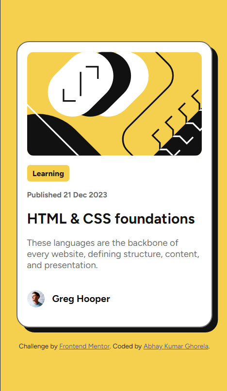

# Frontend Mentor - Blog preview card solution

This is a solution to the [Blog preview card challenge on Frontend Mentor](https://www.frontendmentor.io/challenges/blog-preview-card-ckPaj01IcS). Frontend Mentor challenges help you improve your coding skills by building realistic projects. 

## Table of contents

- [Overview](#overview)
  - [The challenge](#the-challenge)
  - [Screenshot](#screenshot)
  - [Links](#links)
- [My process](#my-process)
  - [Built with](#built-with)
  - [What I learned](#what-i-learned)
  - [Continued development](#continued-development)
- [Author](#author)


## Overview

### The challenge

Users should be able to:

- See hover and focus states for all interactive elements on the page

### Screenshot

#### Desktop View


#### Mobile View



### Links

- Solution URL: (https://github.com/AbhayGhorela/blog-preview-card)
- Live Site URL: (https://abhayghorela.github.io/blog-preview-card/)

## My process

### Built with

- Semantic HTML5 markup
- CSS custom properties
- Flexbox
- Mobile-first workflow


### What I learned

I added new CSS properties, such as content fit and a new html tag time, to this project.

```html
<time datetime="2023-21-12">Published 21 Dec 2023</time>
```
```css
.proud-of-this-css {
  max-width: fit-content;
}
```


### Continued development

This card is very helpful to me because it can be used again in other projects and saves time when making a fresh card of this kind. 


## Author

- Frontend Mentor - [@AbhayGhorela](https://www.frontendmentor.io/profile/AbhayGhorela)

